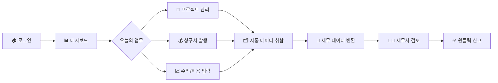

# Weave 프로젝트 발표자료

---

## 슬라이드 1: 표지
# **Weave**
### 프리랜서를 위한 통합 비즈니스 플랫폼
#### ERP와 세무를 하나로 연결하는 혁신적 솔루션

**팀원**
- 박현일
- 조용현

---

## 슬라이드 2: 서비스 기획 배경

### 🎯 **왜 Weave인가?**

#### **시장 현황**
- 🚀 **프리랜서 시장 급성장**: 국내 프리랜서 인구 687만명 돌파 (2024년 기준)
- 💼 **1인 기업 증가**: 매년 15% 이상 성장세
- 📊 **디지털 전환 가속화**: 원격근무와 긱 이코노미 확대

#### **핵심 인사이트**
> "프리랜서는 **'돈 버는 일'**에 집중하고 싶지만,  
> **'돈 관리하는 일'** 때문에 시간과 에너지를 낭비합니다"

#### **솔루션**
**Weave = 업무 관리(ERP) + 세무 자동화를 하나로**

---

## 슬라이드 3: 문제상황 분석

### 🔍 **프리랜서가 겪는 3대 Pain Point**

#### **1. 데이터 파편화의 악순환** 🔄
```
노션(프로젝트) → 엑셀(청구서) → 카톡(비용처리) → ???(세금신고)
```
- 연말 세금신고 시 **평균 3일** 소요
- 데이터 누락으로 인한 **절세 기회 상실**

#### **2. 세무 불확실성의 공포** ⚠️
- **42%**의 프리랜서가 가산세 경험
- **78%**가 세법 이해 부족 호소
- 잘못된 신고로 인한 **법적 리스크 상존**

#### **3. 업무 증빙의 부재** 📄
- 프로젝트 종료 후 **문서 관리 체계 부재**
- 계약 분쟁 시 **증빙 자료 부족**
- 수익/비용 관리의 **비체계성**

### **기존 솔루션의 한계**
| 구분 | 삼쩜삼 | 더존 | Weave |
|------|--------|------|-------|
| 세무 편의성 | ⭐⭐⭐⭐⭐ | ⭐⭐ | ⭐⭐⭐⭐⭐ |
| 업무 관리 | ❌ | ⭐⭐⭐⭐⭐ | ⭐⭐⭐⭐ |
| 통합성 | ❌ | ❌ | ⭐⭐⭐⭐⭐ |
| 사용성 | ⭐⭐⭐⭐⭐ | ⭐⭐ | ⭐⭐⭐⭐⭐ |

---

## 슬라이드 4: 사용자 이용 플로우

### 🚀 **Weave와 함께하는 프리랜서의 하루**



### **핵심 사용자 경험**

#### **1단계: 일상 업무 관리** 
- 프로젝트 생성 및 진행 상황 관리
- 계약서 업로드 및 버전 관리
- 청구서 자동 생성 및 발송

#### **2단계: 재무 데이터 자동 수집**
- 수익/비용 자동 분류
- 영수증 OCR 자동 인식
- 실시간 수익성 분석

#### **3단계: 세무 신고 자동화**
- 분기별 부가세 자동 계산
- 연말정산 자료 자동 생성
- 제휴 세무사 원클릭 대리 신고

---

## 슬라이드 5: 서비스 시연

### 🖥️ **Live Demo**

#### **접속 URL**
🔗 **[https://weave-v3.vercel.app](https://weave-v3.vercel.app)**

#### **시연 시나리오**

##### **1. 홈페이지 - 첫인상**
- 프리랜서 타겟 맞춤형 UI/UX
- 핵심 가치 제안 명확한 전달
- 직관적인 CTA (Call-to-Action)

##### **2. 대시보드 - 한눈에 보는 비즈니스**
- 📊 **실시간 수익 현황**: 월별/프로젝트별 수익 차트
- 📈 **진행 중인 프로젝트**: 상태별 프로젝트 카드
- 💰 **이번 달 정산**: 예상 수익과 세금
- 📅 **일정 관리**: 마감일 및 미팅 스케줄

##### **3. 프로젝트 관리 - 체계적인 업무 관리**
- **프로젝트 목록**: 상태별 필터링 (진행중/완료/보류)
- **상세 정보**: 
  - 계약 정보 및 문서 관리
  - 청구 내역 및 결제 상태
  - 프로젝트별 수익성 분석
- **Advanced Table**: 
  - 드래그앤드롭 컬럼 재정렬
  - 실시간 검색 및 필터링
  - 벌크 작업 지원

##### **4. 핵심 기능 하이라이트**
- ✨ **자동 데이터 연동**: ERP 데이터 → 세무 신고 자동 변환
- 🔒 **보안**: Supabase 기반 안전한 데이터 관리
- 📱 **반응형 디자인**: 모바일/태블릿 완벽 지원

---

## 슬라이드 6: 팀원별 역할

### 👥 **Team Weave**

#### **박현일** - Frontend Developer
##### 담당 영역
- 🏠 **홈페이지 개발**
  - 랜딩 페이지 설계 및 구현
  - 사용자 유입 최적화
  - 애니메이션 및 인터랙션 구현
  
- 📊 **대시보드 페이지 개발**
  - 실시간 데이터 시각화 (Recharts)
  - 위젯 시스템 구현
  - 반응형 레이아웃 설계

##### 기술 스택
`Next.js` `TypeScript` `Tailwind CSS` `Recharts`

---

#### **조용현** - UI/UX Developer
##### 담당 영역
- 🎨 **통합 UI 시스템 구축**
  - shadcn/ui 컴포넌트 커스터마이징
  - 디자인 시스템 구축
  - 접근성(a11y) 최적화
  
- 📁 **프로젝트 관리 페이지 개발**
  - Advanced Table 시스템 구현
  - 드래그앤드롭 기능 개발
  - 마스터-디테일 뷰 구현

##### 기술 스택
`React` `shadcn/ui` `@hello-pangea/dnd` `TypeScript`

---

## 슬라이드 7: 기술 아키텍처

### 🏗️ **System Architecture**

```
┌─────────────────────────────────────────────────┐
│                   Frontend                       │
│  Next.js 15 + TypeScript + Tailwind CSS         │
│  ┌──────────┐ ┌──────────┐ ┌──────────┐        │
│  │   Home   │ │Dashboard │ │ Projects │        │
│  └──────────┘ └──────────┘ └──────────┘        │
│                                                  │
│  ┌────────────────────────────────────┐         │
│  │     Component Library (27개)        │         │
│  │   shadcn/ui + Custom Components    │         │
│  └────────────────────────────────────┘         │
└─────────────────────────────────────────────────┘
                        │
                        ↓
┌─────────────────────────────────────────────────┐
│                    Backend                       │
│               Supabase (BaaS)                    │
│  ┌──────────┐ ┌──────────┐ ┌──────────┐        │
│  │   Auth   │ │ Database │ │ Storage  │        │
│  └──────────┘ └──────────┘ └──────────┘        │
└─────────────────────────────────────────────────┘
                        │
                        ↓
┌─────────────────────────────────────────────────┐
│              External Services                   │
│  ┌──────────┐ ┌──────────┐ ┌──────────┐        │
│  │  국세청  │ │ 세무사   │ │   OCR    │        │
│  │   API    │ │  시스템  │ │  Service │        │
│  └──────────┘ └──────────┘ └──────────┘        │
└─────────────────────────────────────────────────┘
```

### **기술 스택 상세**

#### **Frontend**
- **Framework**: Next.js 15 (App Router)
- **Language**: TypeScript 5.9
- **Styling**: Tailwind CSS + CSS Modules
- **UI Library**: shadcn/ui (Radix UI 기반)
- **State**: Zustand
- **Form**: React Hook Form + Zod
- **Charts**: Recharts
- **DnD**: @hello-pangea/dnd

#### **Backend & Infrastructure**
- **BaaS**: Supabase
  - PostgreSQL Database
  - Row Level Security
  - Realtime Subscriptions
  - Edge Functions
- **Deployment**: Vercel
- **CDN**: Vercel Edge Network

#### **개발 도구**
- **Linting**: ESLint + Prettier
- **Type Checking**: TypeScript strict mode
- **Documentation**: Auto-sync claude.md system

---

## 슬라이드 8: 어려웠던 점 (회고)

### 💪 **도전과 극복**

#### **🔥 최대 난관: 병합 과정의 빌드 에러**

##### **문제 상황**
```bash
❌ Type error: Property 'X' does not exist on type 'Y'
❌ Module not found: Can't resolve '@/components/...'
❌ Hydration mismatch error
```

##### **원인 분석**
1. **타입 정의 충돌**: 각자 개발한 컴포넌트 간 타입 불일치
2. **경로 설정 오류**: tsconfig.json paths 설정 차이
3. **버전 호환성**: Next.js 15와 일부 라이브러리 간 충돌

##### **해결 과정**


##### **얻은 교훈**
- ✅ **초기 설정의 중요성**: 프로젝트 시작 시 규칙 명확화
- ✅ **지속적 통합**: 자주 병합하여 충돌 최소화
- ✅ **타입 안정성**: TypeScript strict mode의 가치
- ✅ **팀 커뮤니케이션**: 코드 리뷰와 페어 프로그래밍

#### **🎯 추가 도전 과제**

##### **1. 상태 관리 복잡도**
- **문제**: 대시보드-프로젝트 간 데이터 동기화
- **해결**: Zustand를 활용한 중앙 상태 관리

##### **2. 성능 최적화**
- **문제**: 대용량 테이블 렌더링 지연
- **해결**: React Window + 가상화 구현

##### **3. 접근성 구현**
- **문제**: 스크린 리더 지원 부족
- **해결**: ARIA 레이블 체계적 적용

---

## 슬라이드 9: 멘토링 받았던 사항

### 🎓 **소중한 피드백과 성장**

#### **👨‍🏫 멘토님의 조언**

##### **1. 실유저 평가의 중요성**
> "개발자 관점이 아닌 **실제 프리랜서 관점**에서 생각하세요"

**적용 사항:**
- 사용자 인터뷰 진행 (5명)
- 페르소나 기반 UX 개선
- 용어를 사용자 친화적으로 변경

##### **2. UI 개선 방향**
> "복잡한 기능보다 **직관적인 인터페이스**가 우선입니다"

**적용 사항:**
- 3-클릭 룰 적용
- 시각적 계층 구조 개선
- 모바일 우선 디자인

##### **3. 진행 자문**
> "MVP를 빠르게 만들고 **반복적으로 개선**하세요"

##### **4. 방향 설정**
> "세무 자동화는 **신뢰**가 핵심입니다"

---

#### **👨‍💻 강사님의 피드백**

##### **코드 리뷰 핵심 포인트**
```typescript
// ❌ Before
const data = projects.filter(p => p.status === 'active')
  .map(p => ({ ...p, tax: p.amount * 0.1 }))

// ✅ After - 가독성과 유지보수성 개선
const activeProjects = projects.filter(isActiveProject);
const projectsWithTax = activeProjects.map(calculateProjectTax);
```

**개선 사항:**
- 함수형 프로그래밍 패턴 적용
- 커스텀 훅 분리
- 에러 바운더리 구현
- 테스트 코드 작성

---

#### **🎉 운영진 피드백**

> "**최고의 피드백** ❤️"

**의미:**
- 팀워크와 열정 인정
- 기술적 완성도 호평
- 사용자 중심 접근 칭찬

---

## 슬라이드 10: Q&A

# 🙋‍♂️ **Questions & Answers**

### 예상 질문

#### **Q1. 수익 모델은 무엇인가요?**
**A:** 
- **Freemium 모델**: 기본 기능 무료, 고급 기능 유료
- **구독형**: 월 9,900원 ~ 29,900원
- **수수료형**: 세무사 연결 시 중개 수수료

#### **Q2. 경쟁사 대비 차별점은?**
**A:** 
- **통합성**: ERP + 세무를 하나로
- **자동화**: 데이터 입력 최소화
- **신뢰성**: 검증된 세무사 네트워크

#### **Q3. 향후 개발 계획은?**
**A:** 
- **Phase 1**: AI 기반 비용 자동 분류
- **Phase 2**: 은행 API 연동
- **Phase 3**: 글로벌 진출 (영문 버전)

#### **Q4. 기술적 확장성은?**
**A:** 
- **마이크로서비스 전환 준비**
- **Kubernetes 기반 스케일링**
- **Multi-tenant 아키텍처**

---

### **감사합니다!** 🙏

**Contact**
- 📧 Email: hyunil8702@gmail.com
- 🌐 Website: https://weave-v3.vercel.app

---

## 부록: 주요 화면 스크린샷

### 1. 홈페이지
- 히어로 섹션: 명확한 가치 제안
- 기능 소개: 3가지 핵심 기능
- 타겟 사용자: 프리랜서/1인 기업
- CTA: 무료 체험 시작

### 2. 대시보드
- 수익 차트 (월별/프로젝트별)
- 프로젝트 진행 현황
- 빠른 작업 버튼
- 알림 및 일정

### 3. 프로젝트 관리
- Advanced Table System
- 마스터-디테일 뷰
- 필터 및 검색
- 벌크 액션

### 4. 프로젝트 상세
- Overview 탭: 기본 정보
- Contract 탭: 계약 관리
- Billing 탭: 청구/결제
- Documents 탭: 문서 관리